# ClaimHeart Unified Workflow Graph

This file contains a single, end-to-end Mermaid workflow diagram for ClaimHeart. It is meant to be the one-page visual reference that shows:

- all three user types and their dashboards
- the shared frontend and backend flow
- the multi-agent claim processing pipeline
- storage, policy knowledge, fraud baselines, notifications, and audit outputs

```mermaid
flowchart LR

    %% =========================
    %% USER AND EXPERIENCE LAYER
    %% =========================

    subgraph USERS["Stakeholders"]
        PAT["Patient User\nTracks claim status,\nreads letters,\nuploads extra documents"]
        HOS["Hospital / TPA Staff\nSubmits pre-auth,\ndischarge docs,\nresponds to queries"]
        INS["Insurance Reviewer\nDoctor panel,\nclaims ops,\nfinal decision owner"]
    end

    subgraph FRONTEND["Frontend Experience - Next.js"]
        PD["Patient Dashboard\nTimeline, status,\nletters, uploads,\nappeal actions"]
        HD["Hospital / TPA Dashboard\nClaim intake, query inbox,\nmissing docs,\nTAT clock"]
        ID["Insurer Dashboard\nFraud queue,\npolicy evidence,\ndecision controls,\naudit view"]
        UI["Shared UI Shell\nRole router,\npage layouts,\nworkspace composition"]
        STATE["Client State + API Client\nSession state,\nrequest handling,\ncache and refresh"]
    end

    %% =========================
    %% BACKEND CONTROL PLANE
    %% =========================

    subgraph BACKEND["Backend Core - FastAPI + Celery"]
        APIGW["API Gateway\nRBAC, validation,\nrouting, claim stage control"]
        CLAIMSVC["Claim Service\nCreate/update claims,\nstore metadata,\ndispatch workflows"]
        POLICYSVC["Policy Service\nPolicy upload,\nindex status,\nretrieval support"]
        FRAUDSVC["Fraud Service\nRisk queries,\nreview actions,\nfraud retrieval"]
        LETTERSVC["Letter Service\nDraft review,\nletter edits,\ncommunication history"]
        USERSVC["User/Auth Service\nIdentity,\nsession,\nrole resolution"]
        QUEUE["Redis Queue"]
        WORKER["Celery Workers"]
        ORCH["Claim Orchestrator\nFan-out, retries,\nworkflow state,\nparallel coordination"]
    end

    %% =========================
    %% AGENT COMMITTEE
    %% =========================

    subgraph AGENTS["Committee of Specialized Agents - Run in Parallel"]
        REDACT["PII Redaction Layer\nMask identity fields\nbefore model-heavy processing"]
        EXTRACT["Extractor Agent\nPDF parsing + OCR/Vision\ninto structured claim JSON"]
        CONTEXT["Claim Context Builder\nCombine medical facts,\nbilling, policy metadata,\nclaim history, stage state"]
        POLICY["Policy RAG Agent\nCoverage rules,\nsub-limits, exclusions,\nwaiting periods, citations"]
        FRAUD["Fraud Investigator Agent\nDuplicate checks,\nbaseline variance,\nrule engine, anomaly logic"]
        TAT["TAT Monitor Agent\nSLA timer,\nbreach warning,\ndelay reason, escalation"]
        MERGE["Decision Aggregator\nMerge policy, fraud,\nand TAT outputs into\none explainable decision packet"]
        MEDIATOR["Mediator Agent\nPatient letter,\nhospital query,\ninsurer summary,\ndelay explanation"]
        FIELDTRIGGER["Field Verification Trigger\nEscalate high-risk or\nunverifiable cases"]
    end

    %% =========================
    %% DATA AND KNOWLEDGE
    %% =========================

    subgraph DATA["Data and Knowledge Layer"]
        DB[("PostgreSQL Claim DB\nClaims, statuses,\nagent outputs, letters,\nfraud flags, stage history")]
        DOCS["Document Store / S3\nRaw PDFs, images,\nredacted copies,\nsupporting reports"]
        VECTOR["Policy Vector Store\nEmbeddings,\nretrieval nodes,\nsource citations"]
        BASELINE["Cost Baselines + Clinical Rules\nRegional tariffs,\nroom rent caps,\ntest protocol limits"]
        AUDIT["Audit Ledger\nMachine actions,\nhuman overrides,\ndecision history"]
        CACHE["Redis Cache + Timers\nSession cache,\nTAT counters,\njob coordination"]
    end

    %% =========================
    %% EXTERNAL INPUTS AND OUTPUTS
    %% =========================

    subgraph EXTERNAL["External Sources and Output Channels"]
        POLICYPDF["Policy PDFs"]
        INGEST["Policy Chunking + Embedding Pipeline"]
        NOTIFY["SMS / Email / Push / In-App Alerts"]
        FIELDAGENT["Physical Field Agent\nOn-ground hospital verification"]
    end

    %% =========================
    %% USER TO DASHBOARD FLOW
    %% =========================

    PAT -->|"tracks claim / uploads docs"| PD
    HOS -->|"submits pre-auth / discharge docs"| HD
    INS -->|"reviews decision / raises query"| ID

    PD --> UI
    HD --> UI
    ID --> UI
    UI --> STATE
    STATE --> APIGW

    %% =========================
    %% API AND SERVICE FLOW
    %% =========================

    APIGW --> USERSVC
    APIGW --> CLAIMSVC
    APIGW --> POLICYSVC
    APIGW --> FRAUDSVC
    APIGW --> LETTERSVC
    APIGW --> AUDIT

    CLAIMSVC -->|"claim record + stage data"| DB
    CLAIMSVC -->|"raw uploads"| DOCS
    CLAIMSVC -->|"enqueue claim workflow"| QUEUE

    POLICYSVC --> VECTOR
    POLICYSVC --> DB
    FRAUDSVC --> DB
    LETTERSVC --> DB

    QUEUE --> WORKER
    WORKER --> ORCH
    QUEUE --> CACHE
    DB --> CACHE

    %% =========================
    %% CLAIM PROCESSING PIPELINE
    %% =========================

    DOCS -->|"claim files"| REDACT
    ORCH --> REDACT
    REDACT --> EXTRACT
    EXTRACT -->|"structured claim JSON"| CONTEXT
    EXTRACT --> DB

    DB -->|"claim history + policy refs + stage state"| CONTEXT

    CONTEXT -->|"coverage context"| POLICY
    CONTEXT -->|"risk context"| FRAUD
    CONTEXT -->|"timers and stage status"| TAT

    VECTOR -->|"relevant clauses + citations"| POLICY
    BASELINE -->|"cost and clinical reference"| FRAUD
    CACHE -->|"SLA counters"| TAT

    POLICY -->|"coverage decision + citation"| MERGE
    FRAUD -->|"risk score + evidence"| MERGE
    TAT -->|"warning / breach / bottleneck"| MERGE

    MERGE -->|"final decision packet"| MEDIATOR
    MERGE -->|"persist merged decision"| DB
    MERGE -->|"audit explanation trail"| AUDIT
    MERGE -->|"high risk or unresolved mismatch"| FIELDTRIGGER

    MEDIATOR -->|"patient letter / hospital query /\ninsurer summary"| DB
    MEDIATOR -->|"send communications"| NOTIFY
    MEDIATOR --> AUDIT

    FIELDTRIGGER -->|"dispatch case"| FIELDAGENT
    FIELDAGENT -->|"verification report"| DB
    FIELDAGENT --> AUDIT

    %% =========================
    %% FEEDBACK INTO DASHBOARDS
    %% =========================

    DB -->|"claim timeline + status + letters"| PD
    DB -->|"open queries + document gaps + TAT"| HD
    DB -->|"decision queue + evidence + actions"| ID
    AUDIT -->|"full audit history"| ID
    NOTIFY --> PAT
    NOTIFY --> HOS
    NOTIFY --> INS

    %% =========================
    %% KNOWLEDGE INGESTION
    %% =========================

    POLICYPDF --> INGEST
    INGEST --> VECTOR

    %% =========================
    %% STYLING
    %% =========================

    classDef actor fill:#fef3c7,stroke:#d97706,stroke-width:1.5px,color:#111;
    classDef ui fill:#dbeafe,stroke:#2563eb,stroke-width:1.5px,color:#111;
    classDef backend fill:#ede9fe,stroke:#7c3aed,stroke-width:1.5px,color:#111;
    classDef agent fill:#dcfce7,stroke:#16a34a,stroke-width:1.5px,color:#111;
    classDef decision fill:#bbf7d0,stroke:#15803d,stroke-width:2px,color:#111;
    classDef data fill:#fce7f3,stroke:#db2777,stroke-width:1.5px,color:#111;
    classDef ext fill:#f3f4f6,stroke:#4b5563,stroke-width:1.5px,color:#111;

    class PAT,HOS,INS actor;
    class PD,HD,ID,UI,STATE ui;
    class APIGW,CLAIMSVC,POLICYSVC,FRAUDSVC,LETTERSVC,USERSVC,QUEUE,WORKER,ORCH backend;
    class REDACT,EXTRACT,CONTEXT,POLICY,FRAUD,TAT,MEDIATOR,FIELDTRIGGER agent;
    class MERGE decision;
    class DB,DOCS,VECTOR,BASELINE,AUDIT,CACHE data;
    class POLICYPDF,INGEST,NOTIFY,FIELDAGENT ext;
```

